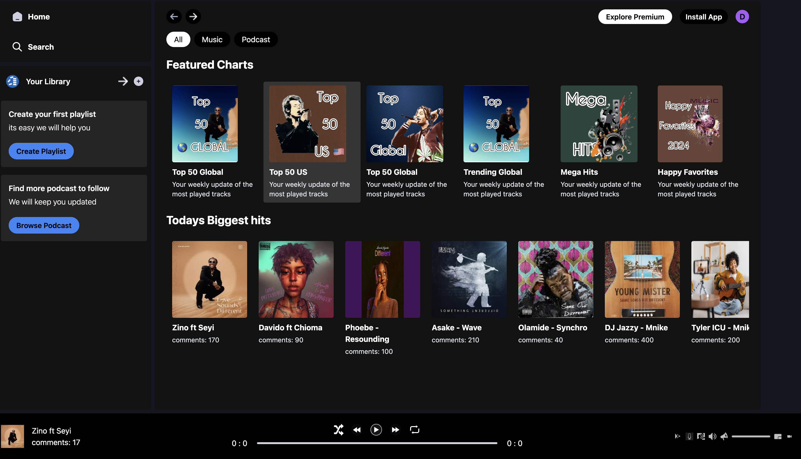
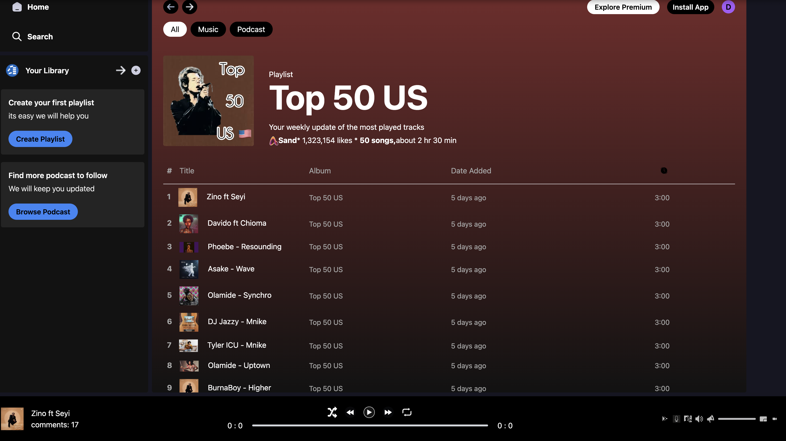
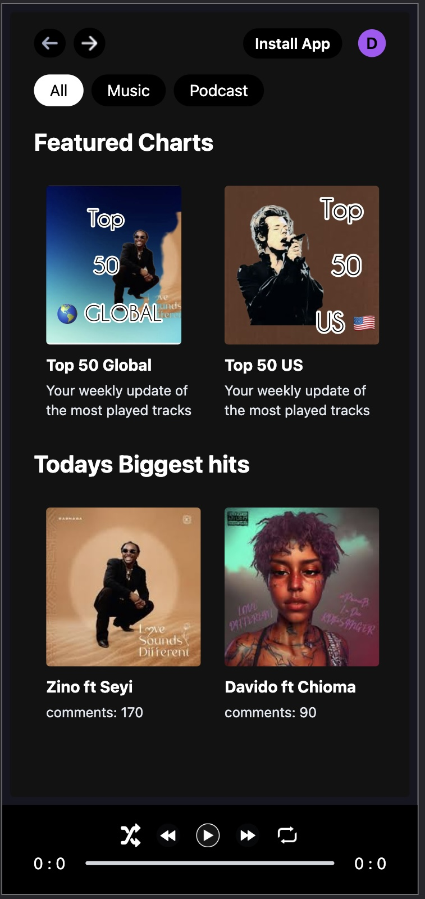
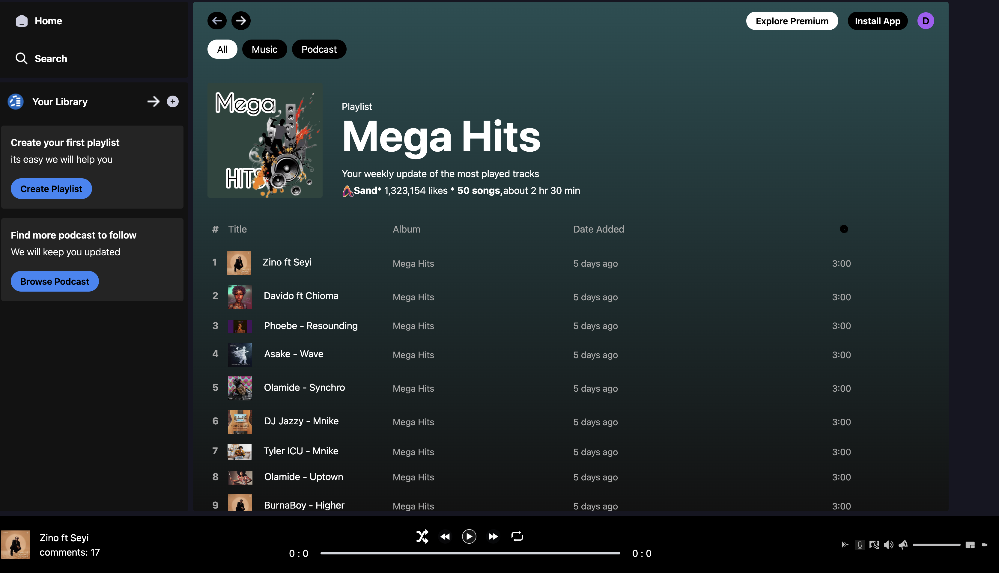

SandMusic Application

Welcome to the SandMusic Application! This project is a web-based music player with a focus on mobile responsiveness, utilizing modern frontend technologies and libraries such as React, useContext, and useRef.

Project Overview

SandMusic is a music web application designed to provide an intuitive and responsive user experience. The project employs useContext and useRef hooks to manage and control the music player state and interactions effectively.

Mobile Responsive

Features

Music Playback: Play, pause, skip, and seek tracks.
Responsive Design: Optimized for mobile devices.
Frontend Technologies: Built with React, Tailwind CSS, and Vite.
State Management: Using useContext for global state and useRef for accessing and manipulating DOM elements directly.

Usage

The core of the music player's functionality is encapsulated within the PlayerContextProvider, which provides context values to manage and control the music player state and actions.

Contributing

We welcome contributions to improve SandMusic! If you have any ideas, suggestions, or bug fixes, please submit a pull request or open an issue on GitHub.